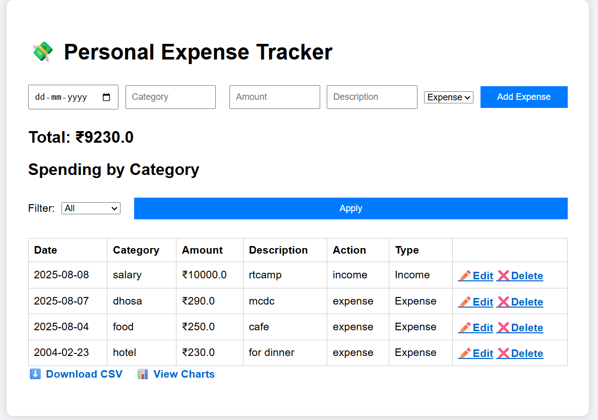

<<<<<<< HEAD
# Expense Tracker (Flask)

A simple personal expense & income tracker built with **Flask** and **SQLite**.  
Add / edit / delete entries, filter by today/month/year, export CSV, and view charts (Chart.js) for quick insights.

 

## Features
- Add income and expense entries (type: `income` / `expense`)
- Edit and delete records
- Filter by Today / This Month / This Year
- CSV export (filtered export supported)
- Visualizations: Income vs Expense (bar) and Expense by Category (pie) using Chart.js
- Mobile-friendly responsive layout
- Local network testing (run on `0.0.0.0` to access from phone)

## Tech stack
- Python 3.x, Flask
- SQLite (local file)
- Vanilla HTML/CSS/JS, Chart.js for charts

## Getting started (run locally)

**1. Clone the repo**
```bash
git clone https://github.com/<your-username>/<repo-name>.git
cd <repo-name>
=======
# Expense Tracker (Flask)

A simple personal expense & income tracker built with **Flask** and **SQLite**.  
Add / edit / delete entries, filter by today/month/year, export CSV, and view charts (Chart.js) for quick insights.

 

## Features
- Add income and expense entries (type: `income` / `expense`)
- Edit and delete records
- Filter by Today / This Month / This Year
- CSV export (filtered export supported)
- Visualizations: Income vs Expense (bar) and Expense by Category (pie) using Chart.js
- Mobile-friendly responsive layout
- Local network testing (run on `0.0.0.0` to access from phone)

## Tech stack
- Python 3.x, Flask
- SQLite (local file)
- Vanilla HTML/CSS/JS, Chart.js for charts

## Getting started (run locally)

**1. Clone the repo**
```bash
git clone https://github.com/<your-username>/<repo-name>.git
cd <repo-name>
>>>>>>> 5532091e9362b98f1c7d09499ffd43613cddb3b8
